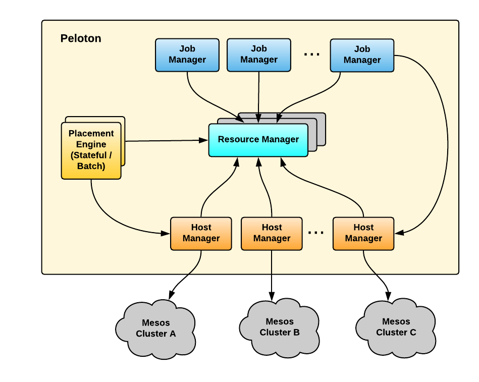

# Peloton Architecture

Cluster management, a common software infrastructure among technology
companies, aggregates compute resources from a collection of physical
hosts into a shared resource pool, amplifying compute power and
allowing for flexible use of data center hardware. Cluster management
provides an abstraction layer for various workloads. With the
increasing scale of business, efficient use of cluster resources
becomes very important.

However, compute stack was underutilized due to several dedicated
clusters for different use cases, such as batch (Hadoop), stateless
(microservices), and stateful (including Cassandra and MySQL). In
addition, the very dynamic nature of business means vast fluctuations
in resources demands. These edge cases forces to over-provision
hardware for each cluster in order to handle peak workloads. Relying
on dedicated clusters also means that we can't share compute resources
between them. During peak periods, one cluster may be starving for
resources while others have resources to spare.

To make better use of our resources, we needed to co-locate these
workloads on to one single compute platform. The resulting
efficiencies would reduce infrastructure cost, ultimately helping the
business.

The solution we arrived at was Peloton, a unified scheduler designed
to manage resources across distinct workloads, combining our separate
clusters into a unified one. Peloton supports all workloads with a
single shared platform, balancing resource use, elastically sharing
resources, and helping plan for future capacity needs.

There are generally four main categories of compute cluster
workloads : stateless, stateful, batch, and daemon jobs.

- Stateless Jobs are long-running services without persistent states.
- Stateful Jobs are long-running services, such as those from
  Cassandra, MySQL, and Redis, that have persistent state on local
  disks.
- Batch Jobs typically take a few minutes to a few days to run to
  completion. There is a broad category of batch jobs for data
  analytics, machine learning, maps, and autonomous vehicles-related
  processing, emanating from software such as Hadoop, Spark, and
  TensorFlow. These jobs are preemptible by nature and less sensitive
  to short-term performance fluctuations due to cluster resource
  shortages.
- Daemon Jobs are agents running on each host for infrastructure
  components, such as Apache Kafka, HAProxy, and M3 Collector.

To achieve high-availability and scalability, Peloton uses an
active-active architecture with four separate daemon types: job
manager, resource manager, placement engine, and host manager. The
interactions among those daemons are designed so that the dependencies
are minimized and only occur in one direction. All four daemons depend
on Zookeeper for service discovery and leader election.

Figure , below, shows the high-level architecture of Peloton built on
top of Mesos, Zookeeper, and Cassandra:

The Peloton architecture is made up of the following components:

- Peloton UI: is web-based UI for managing jobs, tasks, volumes, and
  resource pools in Peloton.
- Peloton CLI: is command-line interface for Peloton with similar
  functionality to the web-based interface.
- Peloton API: uses Protocol Buffers as the interface definition
  language and YARPC as its RPC runtime. Peloton UI, Peloton CLI, and
  other Peloton extensions are all built on top of the same Peloton
  API.
- Host Manager: abstracts away Mesos details from other Peloton
  components. It registers with Mesos via Mesos HTTP API.
- Resource Manager: maintains the resource pool hierarchy and
  periodically calculates the resource entitlement of each resource
  pool, which is then used to schedule or preempt tasks
  correspondingly.
- Placement Engine: finds the placement (i.e., task to host mapping)
  by taking into consideration the job and task constraints as well as
  host attributes. Placement engines could be pluggable for different
  job types such as stateful services and batch jobs.
- Job Manager: handles the lifecycle of jobs, tasks, and volumes. It
  also supports rolling upgrades of tasks in a job for long-running
  services.
- Storage Gateway: provides an abstraction layer on top of different
  storage backends so that we can migrate from one storage backend to
  another without significant change in Peloton itself. We have a
  default backend for Cassandra built-in, but can extend it to other
  backends.
- Group Membership: manages the set of Peloton master instances and
  elects a leader to both register to Mesos as a framework and
  instantiate a resource manager.

All four Peloton daemons have high availability guarantees with either
active-active instances or leader-follower topology. Peloton
guarantees that all tasks are executed at least once, even after any
application instance fails. For stateless Peloton daemons like Job
Manager and Placement Engine, any instance failure can be tolerated by
its built-in retry mechanism.

The scalability of Peloton has a few dimensions, including the size of
the cluster in number of hosts, the number of running jobs and tasks,
and the maximum throughput of scheduling decisions and launching
tasks. Peloton aims to support large-scale batch jobs, e.g., millions
of active tasks, 50,000 hosts, and 1,000 tasks per second. Both Job
Manager and Placement Engine can be scaled out by adding more
instances. All the API requests to Job Manager will be handled by the
storage backend, making the scalability of the storage backend
critical to Peloton. The Peloton resource manager has a single leader
but it should scale to millions of tasks, since these tasks are
minimal, only having resource configuration and task
constraints. Also, all the tasks in the resource manager are in
memory, so it should be able to handle high throughput of task enqueue
and dequeue.

Mesos is known to scale to about 45,000 hosts when running about
200,000 long-running tasks that have a very low churn rate. However,
when we scale to larger cluster sizes, for instance, 50,000 hosts and
highly dynamic batch jobs, Mesos might become a bottleneck due to the
centralized design of its master and single event channel.

In Peloton, Mesos is an aggregator for all hosts, allowing the system
to manage resources from multiple Mesos clusters. Therefore, Peloton
can be scaled up by managing multiple Mesos clusters which are
well-sized for our workload profile. For Peloton to manage multiple
mesos clusters , it can have set of host managers for each Mesos
cluster. Figure 5, below, shows an example of scaling up Peloton by
managing multiple Mesos clusters via sharded host managers:

