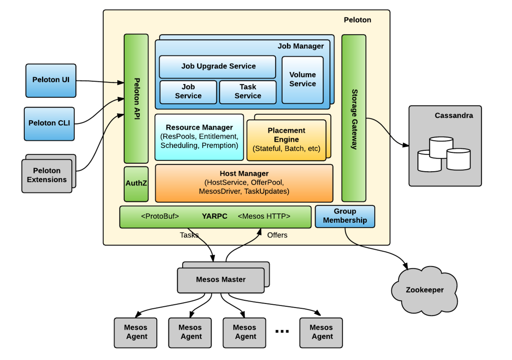

# Peloton

As compute clusters scale, making efficient use of cluster resources
becomes very important. Peloton is a *Unified Resource Scheduler* to
co-schedule mixed types of workloads such as batch, stateless and
stateful jobs in a single cluster for better resource
utilization. Peloton is designed for web-scale companies like Uber
with millions of containers and tens of thousands of nodes. Peloton
features advanced resource management capabilities such as elastic
resource sharing, hierarchical max-min fairness, resource overcommit,
workload preemption, etc. Peloton is also Cloud agnostic and can be run
in on-premise datacenters or in the Cloud.

For more details, please see the Peloton [Blog
Post](https://eng.uber.com/peloton/) and
[Documentation](https://peloton.readthedocs.io/en/latest/).

## Features

- **Elastic Resource Sharing**: Support hierachical resource pools to
  elastically share resources among different teams.

- **Resource Overcommit and Task Preemption**: Improve cluster
  utilization by scheduling workloads using slack resources and
  preempting best effort workloads.

- **Optimized for Big Data and Machine Learning**: Support GPU and Gang
  scheduling for Tensorflow. Also support advanced Spark features such
  as dynamic resource allocation.

- **High Scalability**: Scale to millions of containers and tens of
  thousands of nodes.

- **Protobuf/gRPC based API**: Support most of the language bindings
  such as golang, java, python, node.js etc.

- **Co-scheduling Mixed Workloads**: Support mixed workloads such as
  batch, stateless and stateful jobs in a single cluster.

## Getting Started

See the [Tutorial](tutorial.md) for step-by-step
instructions to start a local minicluster and submit a HelloWorld job
to Peloton.

## Architecture
To achieve high-availability and scalability, Peloton uses an
active-active architecture with four separate daemon types: job
manager, resource manager, placement engine, and host manager. The
interactions among those daemons are designed so that the dependencies
are minimized and only occur in one direction. All four daemons depend
on Zookeeper for service discovery and leader election.

Figure , below, shows the high-level architecture of Peloton built on
top of Mesos, Zookeeper, and Cassandra:

### Components:
Peloton consists of the following components:

- **Peloton UI**: is web-based UI for managing jobs, tasks, volumes, and
  resource pools in Peloton.
- **Peloton CLI**: is command-line interface for Peloton with similar
  functionality to the web-based interface.
- **Peloton API**: uses Protocol Buffers as the interface definition
  language and YARPC as its RPC runtime. Peloton UI, Peloton CLI, and
  other Peloton extensions are all built on top of the same Peloton
  API.
- **Host Manager**: abstracts away Mesos details from other Peloton
  components. It registers with Mesos via Mesos HTTP API.
- **Resource Manager**: maintains the resource pool hierarchy and
  periodically calculates the resource entitlement of each resource
  pool, which is then used to schedule or preempt tasks
  correspondingly.
- **Placement Engine**: finds the placement (i.e., task to host mapping)
  by taking into consideration the job and task constraints as well as
  host attributes. Placement engines could be pluggable for different
  job types such as stateful services and batch jobs.
- **Job Manager**: handles the lifecycle of jobs, tasks, and volumes. It
  also supports rolling upgrades of tasks in a job for long-running
  services.
- **Storage Gateway**: provides an abstraction layer on top of different
  storage backends so that we can migrate from one storage backend to
  another without significant change in Peloton itself. We have a
  default backend for Cassandra built-in, but can extend it to other
  backends.
- **Group Membership**: manages the set of Peloton master instances and
  elects a leader to both register to Mesos as a framework and
  instantiate a resource manager.

## References

### User Guide
See the [User Guide](user-guide.md) for more detailed
information on how to use Peloton.

### Peloton CLI
Peloton CLI is a command line interface for interacting with Peloton
clusters, such as creating jobs, check job status etc. For detailed
Peloton CLI commands and arguments, see [CLI Reference](cli-reference.md).

### Peloton API
Peloton defines the APIs using Protobuf as the IDL and the clients can
access Peloton API via gRPC. Peloton supports three client bindings by
default including Python, Golang and Java. Any other language bindings
supported by gRPC should work as well. 

See the [API Guide](api-guide.md) for examples of how to use
Peloton clients to access the APIs. For detailed Peloton API
definition, see the [API Reference](api-reference.md).

## Contributing
See the [Developer Guide](developer-guide.md) on how to build Peloton
from source code.

## Resources

### Documentation

- [Peloton Documentation](https://peloton.readthedocs.io/en/latest/)

### Blogs

- [Peloton blog from Uber Engineering](https://eng.uber.com/peloton/)

### Tech Talks

- [KubeCon 2018, Seattle](https://sched.co/GrTx) ([Slides](https://schd.ws/hosted_files/kccna18/29/Peloton_%20KubeCon%202018.pdf), [Video](https://www.youtube.com/watch?v=USgbj87Ztlk))
- [MesosCon 2018, San Francisco](https://sched.co/HYTn)
- [MesosCon 2017, Los Angeles](https://sched.co/BYaD) ([Slides](http://events17.linuxfoundation.org/sites/events/files/slides/MesosCon_Distributed_Deep_Learning_v4.pdf), [Video](https://www.youtube.com/watch?v=Ktc3GjshHcc))

## Contact
To contact us, please join our [Slack channel](https://join.slack.com/t/peloton-scheduler/shared_invite/enQtNTU5ODIzOTY4NDMyLTY2NmEwN2Y5ZGMzMzk4ZDE1NTNlYjE4M2E4Njg2OWY1MTk5M2U2NTgxZDUyMjAwYWE4ZjY5M2JlZGU1ZTc2MjI).

## License
Peloton is under the Apache 2.0 license. See the LICENSE file for details.
