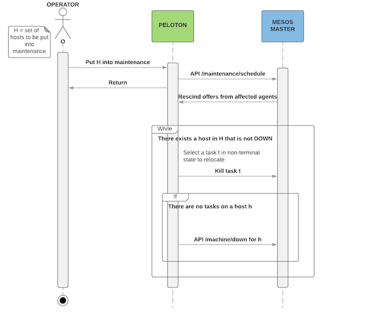

# Operating Peloton Clusters

## Installation

## Upgrades

## Monitoring

### Metrics

### Alerts

### Dashboards

## Host Maintenance
A compute workload can be subject to host level disruption: either
voluntary (e.g. HW maintenance, kernel upgrade) or involuntary
(e.g. HW failure, kernel panic, NFS mount failure), which make it
necessary to handle host level disruption on the scheduler side in
order to not disturb the affected workload and reach the job level
goal state. This scheduler behavior can be defined as putting compute
hosts in “maintenance mode”.

Peloton host maintenance ensures graceful termination of tasks before
putting the hosts into maintenance.

### Peloton Host States
At any given point of time, a host will be in one of the following
states
* `HOST_STATE_UP` - The host is healthy. Tasks can be scheduled on the
  host.
* `HOST_STATE_DRAINING` - The host is being drained. There will be no
  further placement of tasks on the host. The tasks running on the
  host are being rescheduled.
* `HOST_STATE_DRAINED` - The host has been drained of all tasks.
* `HOST_STATE_DOWN` - The host has been removed from the cluster and
  is ready for maintenance operations (HW repair/replacement, kernel
  upgrade etc.)

### Architecture
Peloton makes use of Mesos Maintenance Primitives to perform
maintenance on hosts.  The image below shows the interaction between
Peloton and Mesos Master.




1. The ‘Operator’ will request Peloton to put a list of hosts H into
   maintenance.
2. Peloton constructs a maintenance schedule as a JSON document and
   posts it to the Mesos Master /maintenance/schedule HTTP endpoint (A
   maintenance schedule consists of one or more maintenance windows. A
   maintenance window has a list of hosts and an unavailability
   window - <start time, duration>).
3. Mesos Master will rescind all existing offers from affected agents
   and send out ‘Inverse offers’. This ensures no further placement of
   task on the affected agents.
4. Peloton starts rescheduling the tasks placed on the affected
   agents, doing the following steps until all hosts in the list are
   in HOST_STATE_DOWN:
    1.  Select a task for rescheduling. The selected task is killed
        and relaunched on another host. The rescheduling model will be
        similar to the preemption model.
    2. If a host h in H is drained of all tasks, set state to
       HOST_STATE_DRAINED then start maintenance on this host by
       posting to the Mesos Master /machine/down HTTP endpoint. This
       causes all the mesos agents (processes) running on these
       machines to become unregistered from Mesos Master and won’t be
       allowed to re-register until maintenance is complete. Set state
       of the host to HOST_STATE_DOWN.


### CLI commands
#### Start maintenance
```
$ peloton host maintenance start <comma separated hostnames>
```

Put a list of hosts into maintenance. When maintenance is started on
one or more hosts,
* The hosts transition from HOST_STATE_UP to HOST_STATE_DRAINING
  * There will be no further placement of tasks on these hosts
  * Tasks running on these hosts will be killed. The killed tasks will
    be restarted automatically on other available hosts (i.e. hosts
    not in maintenance)
* Once all tasks on a host are killed, that host is put into maintenance

> Eg. `peloton host maintenance start testhostname1,testhostname2`

#### Complete Maintenance
```
$ peloton host maintenance complete <comma separated hostnames>
```

Complete maintenance on a list of hosts which are in maintenance. When
maintenance is completed on one or more hosts, the hosts transition
from HOST_STATE_DOWN to HOST_STATE_UP i.e. the hosts are now added to
the cluster and tasks can be scheduled on them.

> Eg. `peloton host maintenance complete testhostname1,testhostname2`

#### Query hosts
```
$ peloton host query [--states <comma separated host states>]
```

Query hosts by state - `HOST_STATE_UP`, `HOST_STATE_DRAINING`,
`HOST_STATE_DRAINED`, `HOST_STATE_DOWN`. Not specifying any state will
match all states.

> Eg. `peloton host query --states HOST_STATE_DRAINING,HOST_STATE_DOWN`


